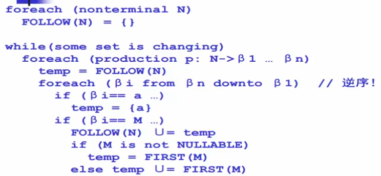

# 编译原理

## 概述，文法和语言
### 字母表
- 字母表：∑ = {a,b,c},a,ab,aac都是∑上的符号串，空串ε长度为0。 
- 对于串abc，a，ab，abc都是其子串，但规定空串不为其子串
#### 符号串的头尾，固有头和固有尾
- 符号串xy，x是xy的头，y是xy的尾。
- 如果x非空，y是固有尾，y非空，x是固有头
- 符号串abc，头有：ε，a，ab，abc，尾有：abc，bc，c，ε。固有头是：ε，a，ab，固有尾是：bc，c，ε。 
#### 符号串的连接
- 符号串的连接：xy，其中x是xy的左子串，y是xy的右子串。
#### 符号串的方幂
- 符号串的方幂：x^n，其中x是方幂的底数，n是方幂的指数。0次幂是空串。
#### 符号串集合
1. 集合A中的一切元素都是某字母表上的符号串，则A是该字母表的符号串集合。
2. 枚举表示法：{a,b,c}
3. 省略表示法：{1，11，111，……}
4. 描述表示法：{x|x满足c}，例如：ε = {1}，A = {x|x是ε字母表上的符号串，1<=|x|<=3}。空集不含任何元素的集合，记为∅
5. 乘积：A×B，AB = {xy|x∈A，且y∈B}
6. 闭包：A* = {ε} U A U AA U AAA U ……
7. 正闭包：A+ = A* - ε，不要空串

### 文法和语言
#### 文法
- 文法G[<标识符>（S）]:
  - <标识符> → <标识符>
  - <标识符> → <标识符><字母>
  - <标识符> → <标识符><数字>
  - <字母> → a|b|c|……|z
  - <数字> → 1|2|3|……|9
- ‌文法G定义为四元组(VN, VT, P, S)，其中‌：
  - VN‌：非终结符集合，每个元素称为非终结符号（或语法变量）。非终结符用于表示语法结构中的抽象部分，它们在产生式的左边出现，但不对应具体的字符‌。
  - VT‌：终结符集合，每个元素称为终结符号。终结符对应具体的字符，如字母、数字等，它们在产生式的右边出现‌。
  - P‌：产生式集合。产生式用于定义非终结符如何扩展成更复杂的语法结构。每个产生式通常表示为A → α，其中A是非终结符，α是由终结符和非终结符组成的字符串‌。
  - S‌：识别符或开始符号，也是一个非终结符。S至少要在一条产生式的左边出现，通常作为文法的起点‌。
  - 显然：VN U VT = ∑字汇表，VN ∩ VT = ∅
- v=233<字母>666 w=233a666
  - <字母>::=a则称v直接推导w 记为v=>w,或称w直接归约v，
  - V=>W 推导长度n>=1
  - V=W  推导长度n=0
  - 多步推导的推导长度大于等于1，广义推导的推导长度大于等于0
  - 广义推导x，x属于v，则x是句型，若x属于VT，则x是句子，句型包含句子。
#### 乔姆斯基体系
- 0型文法：α → β，其中 α 和 β 都是符号串，且 α 中至少包含一个非终结符。
- 1型文法（上下文相关文法）：α → β，且 |β| ≥ |α|。特例：α → ε 也是1型文法
- 2型文法（上下文无关）α → β，左部必须是一个非终结符
- 3型文法（正规文法 ）：
  - 右线性文法：非终结符 A 只能生成 aB 或 a，其中 a 是终结符，B 是非终结符，非终结符只能出现在右端。
  - 左线性文法：非终结符 A 只能生成 Ba 或 a，非终结符只能出现在左端。
 
#### 语法分析树
- 语法分析树：由文法G生成的句子x的语法分析树，记为T(x)。
- 简单子树：只有单层分支的子树
- 最右推导（规范推导），最左归约，互为逆过程
- 二义性：一个句子有两棵不同的语法分析树，则是二义性句子，文法有二义性句子就是二义性文法，一个语言的所有文法都是二义性则是先天二义性语言
- 自顶向下推导方式，自底向上构造归约，后者更适合程序
#### 自底向上
- 短语：子树的末端节点符号串是相对于子树根的短语
- 简单短语：简单子树构成的符号串是相对于简单子树根的简单短语
- 句柄：最左简单子树的末端节点构成的符号串是句柄

## 正规式和有穷自动机
### DFA五元组 M=(K，S，f，S，Z)
1. K是一有穷状态集;
2. S是一有穷字母表，称输入符号字母表;
3. f是转换函数，是在K'S→K上的映射。如f(ki,a)=kj;
4. S是唯一的一个初态; 
5. Z，是一终态集，终态也称结束态或可接受态
### NFA五元组 M=(K，S，f，S，Z)，其中:
1. K是一有穷状态集;
2. S是一有穷字母表，称输入符号字母表;
3. f是转换函数，是在K'S*一K的子集上的映射;
4. S是初态集:
5. Z，是一终态集，终态也称结束态或可接受态。
### NFA转换成DFA
- 画图，把NFA中的几个状态抽象为一个状态即可

## 自顶向下的文法分析
### First和Follow集
- NULLABLE集：可以推出空串的符号
  - 
- First集：首符号集，该非终结符向下推导后最左边可能出现的非终结符
  - First集的不动点算法
  - 
  - 进一步推广
  - 
  - 基于NULLABLE完整计算First
  - 
  - 
- Follow集：后符号集，该符号右边能出现的非终结符，除去空串。即其后面的符号的First集合-{ε}，若后面的符号可以是空串那就是其产生式左边的符号的follow集
  - 

### 自顶向下分析算法
- 不是一种好的方式，因为推出来的结果不等于待匹配句
- 
- 分析栈回溯，时间复杂度很高。需要一个更好的线性时间的算法
- 用前看符号的方式避免回溯peekToken

### 递归向下分析算法(预测分析，自顶向下的一类gcc4.0，llvm)
- 基本思想：对每一个非终结符构造一个分析函数，用前看符号指导生成式规则的选择
- 
- 消除左递归
- 

### LL(1)分析算法
#### 特性
- 从左到右（l）读入程序，最左（l）推导，采用一个（1）前看符号
- 线性时间，错误定位和诊断信息准确，很多开源工具ANTLR
- 表驱动分析算法
#### 优化逻辑
- 在自顶向下的基础上不用next而是correct，问题就是如何找到correct？
- 通过ll（1）分析表
#### 缺点
- 分析文法类型受限
- 往往需要文法的改写
#### ll(1)分析表
- LL(1)分析表
  - 根据First集，选择到达对应前缀应该选择的生成式
  - 分析表.png)
- First_S集合
  - 把first集合的计算推广到串或者句子上
  - 
- 构造LL(1)分析表
  - 根据First_S集
  - 生成式左边为行号，终结符为列号，使用该非终结符产生对应终结符的生成式号为内容
  - 分析表.png)
- LL(1)表冲突
  - 一个表项有两个生成式可选
  - 分析表冲突.png)
  - 那就不是ll(1)文法不能用ll(1)分析法进行分析
  - 可以采用消除左递归变成右递归或者提取左公因子的方式
- LL(1)分析器
- 分析器.png)

## 自底向上的文法分析
### LR分析算法（移进-归约算法）
- 从左向右读入程序，逆向最右推导，不采用（0）前看符号
- 容易实现但是能分析的文法有限
- 通过自动机构造分析表
- 表.png)
  - s：shift移进，r:reduce归约，g：goto跳转
- LR(0)分析蒜贩
  - 算法.png)
- LR(0)分析表构造算法
  - 分析表构造算法.png)
  - 分析表构造算法1.png)

### SLR分析算法
- 移进-归约算法的改进
- 减少需要归约的情况，去除移进-归约冲突
- 

